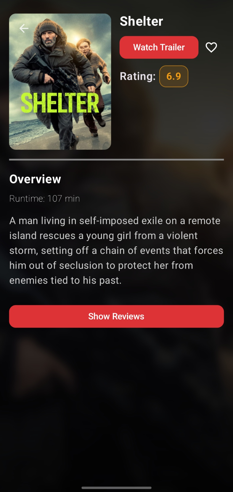
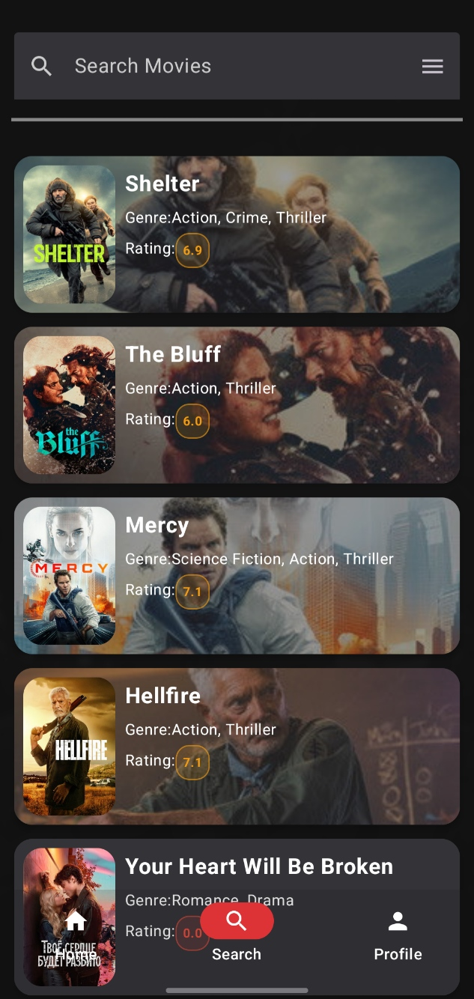
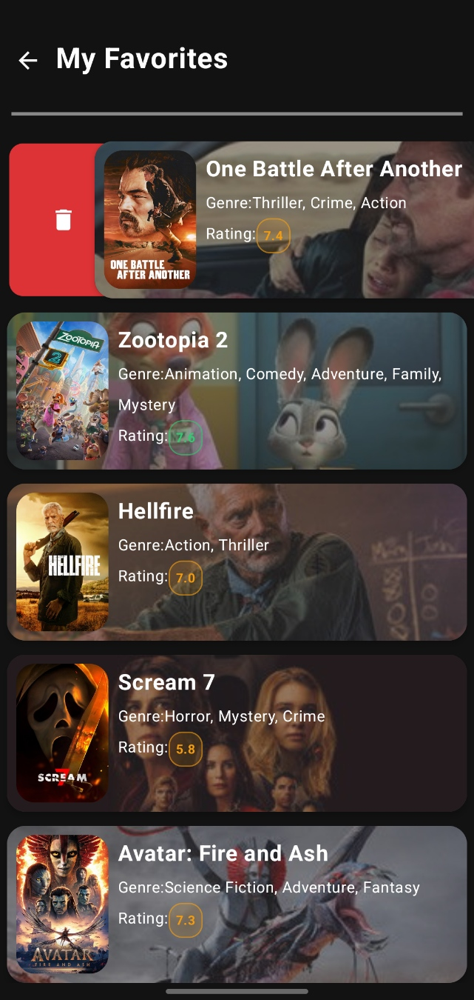

<div align="center">
  <a href="README.tr.md">
    
  </a>
</div>

<div align="center">

  <h1>Cinevo</h1>
  
  <p>
    <strong>Modern Mobile Movie Discovery Application</strong>
  </p>

  <p>
    <a href="https://kotlinlang.org/">
      
    </a>
    <a href="https://developer.android.com/jetpack/compose">
      
    </a>
    <a href="https://firebase.google.com/">
      
    </a>
    <a href="https://www.themoviedb.org/">
      
    </a>
  </p>
</div>

<br />

## About the Project

Cinevo is a modern Android application that allows movie enthusiasts to discover new productions, access detailed information, and create favorite lists.

Built entirely on a declarative UI with Jetpack Compose, the project adheres strictly to Clean Architecture principles. It utilizes the TMDb API for data flow, while user customizations and favorite lists are securely stored on Firebase Firestore.

---

## Features

* **Advanced Movie Discovery:** View popular, now playing, and trending movies instantly.
* **Smart Search:** Fast and dynamic search functionality by movie title.
* **Detailed View:** Access movie posters, summaries, IMDb ratings, release dates, and duration information.
* **Watch Trailers:** Direct trailer viewing via YouTube integration (Intents).
* **Favorites:** Save movies to the cloud using Firebase Firestore infrastructure and access them from anywhere.

---

## Screenshots

<div align="center">
  <table>
    <tr>
      <td align="center"><b>Home Screen</b></td>
      <td align="center"><b>Detail Screen</b></td>
      <td align="center"><b>Search</b></td>
      <td align="center"><b>Favorites</b></td>
    </tr>
    <tr>
      <td></td>
      <td></td>
      <td></td>
      <td></td>
    </tr>
  </table>
</div>

---

## Tech Stack & Libraries

This project was developed using the latest tools in the modern Android development ecosystem:

* **Language:** [Kotlin](https://kotlinlang.org/)
* **UI:** [Jetpack Compose](https://developer.android.com/jetpack/compose) (Material Design 3)
* **Architecture:** MVVM (Model-View-ViewModel) & Clean Architecture
* **Dependency Injection:** [Hilt](https://dagger.dev/hilt/)
* **Network:** [Retrofit](https://square.github.io/retrofit/) & [Gson](https://github.com/google/gson)
* **Concurrency:** [Coroutines](https://github.com/Kotlin/kotlinx.coroutines) & Flow
* **Image Loading:** [Coil](https://coil-kt.github.io/coil/)
* **Backend & Database:** * Firebase Authentication
    * Firebase Firestore
* **API:** [The Movie Database (TMDb) API](https://www.themoviedb.org/documentation/api)

---

## Installation

Follow these steps to run the project on your local machine:

1.  **Clone the Repository:**
    ```bash
    git clone [https://github.com/ArmaganOzkan/cinevo.git](https://github.com/ArmaganOzkan/cinevo.git)
    ```

2.  **API Key Configuration:**
    * Obtain a free API key from [TMDb](https://www.themoviedb.org/).
    * Add the following line to the `local.properties` file:
        ```properties
        TMDB_API_KEY="Your_Api_Key"
        ```

3.  **Firebase Setup:**
    * Create a new project in the Firebase console.
    * Download the `google-services.json` file and place it in the `app/` directory.

4.  **Build:**
    * Open the project in Android Studio and click "Sync Project with Gradle Files".
    * Run on an emulator or physical device.

---

## Developer

<a href="https://github.com/ArmaganOzkan">
  
</a>
